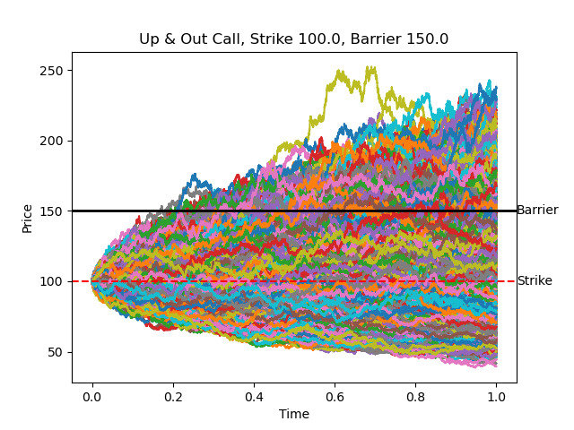

# European Option Barrier Pricing using Monte Carlo (CLI tool)
## Description
 barrier_options.py provides a simple CLI tool to price european barrier options via Monte Carlo simulations <br />
 Each simulated path follows a Geometric Brownian Motion, therefore

 $$
 S_{t + \Delta t} = S_{t}exp((r - \frac{\sigma^{2}}{2})\Delta t + \sigma \sqrt{\Delta t}Z), Z\sim \mathcal{N}(0,1)
 $$

 European barrier options are similar to vanilla european options with the difference that they only come into existance or cease to exist if a certain barrier price is reached. <br />
 In contrast to vanilla european options, whose payoff is solely determined by the final price at expiration, barrier options' payoff also depends on whether or not the barrier price is reached, making barrier options path dependent. <br />
 In mathematical terms, the payoff of a barrier option at expiration can be seen in the following table:

 |Option | Call | Put |
 |-------|------|-----| 
 |Up & In | $(S_{T} - K)^{+}\mathcal{1}_{[B,\infty)}(\max_{t\in \tau} S_{t})$ |  $(K - S_{T})^{+}\mathcal{1}_{[B,\infty)}(\max_{t\in \tau} S_{t})$| 
 |Up & Out | $(S_{T} - K)^{+}\mathcal{1}_{[0,B]}(\max_{t\in \tau} S_{t})$ |  $(K - S_{T})^{+}\mathcal{1}_{[0,B]}(\max_{t\in \tau} S_{t})$| 
 |Down & In | $(S_{T} - K)^{+}\mathcal{1}_{[0,B]}(\min_{t\in \tau} S_{t})$ |  $(K - S_{T})^{+}\mathcal{1}_{[0,B]}(\min_{t\in \tau} S_{t})$|
 |Down & Out | $(S_{T} - K)^{+}\mathcal{1}_{[B,\infty)}(\min_{t\in \tau} S_{t})$ |  $(K - S_{T})^{+}\mathcal{1}_{[B,\infty)}(\min_{t\in \tau} S_{t})$| 

 where: <br />
 $S_{t}$: price of the underlying at time t <br />
 $S_{T}$: price of the underlying at expiration <br />
 K: Strike price <br />
 B: Barrier price <br />

## How to use
In order to use the CLI tool, then following 10 parameters must be provided in order:
1. Option Type:
 - call 
 - put
2. Barrier Type: 
 - up_and_out 
 - down_and_out
 - up_and_in
 - down_and_in
3. Starting Price
4. Strike Price
5. Barrier Price
6. Time left to maturity in years
7. annual volatility (between 0 and 1) 
8. annual risk free rate 
9. number of steps in each simulated path
10. number of simulations

## Example
Suppose we have a contract with the following specifications:
1. Option Type: call 
2. Barrier Type: up_and_out
3. Starting Price: 100
4. Strike Price:100
5. Barrier Price: 150
6. Time left to maturity in years: 1
7. annual volatility (between 0 and 1): 0.25 (25%)
8. annual risk free rate: 0.04 (4%)

and we want 10000 simulations with 10000 steps each

9. number of steps in each simulated path: 10000
10. number of simulations: 10000

In order to use the CLI tool, we must cd to the directory that contains the barrier_options.py file.
On the command line we write: 
```
python3 barrier_options.py call up_and_out 100 100 150 1 0.25 0.04 10000 10000
```
This gives us the following output
```
Contract Specifications
-----------------------------------------------------------------------
Option type:                    call
Barrier type:                   up_and_out
Initial price:                  100.0
Strike price:                   100.0
Barrier price:                  150.0
Time to maturity (in years):    1.0
Annual volatility:              0.25
Annual risk free rate:          0.04

Number of steps:                10000
Number of simulations:          10000

Estimated contract value: 6.28577080873023
```



## Requirements
numpy >= 1.25.2

matplotlib >= 3.5.1

